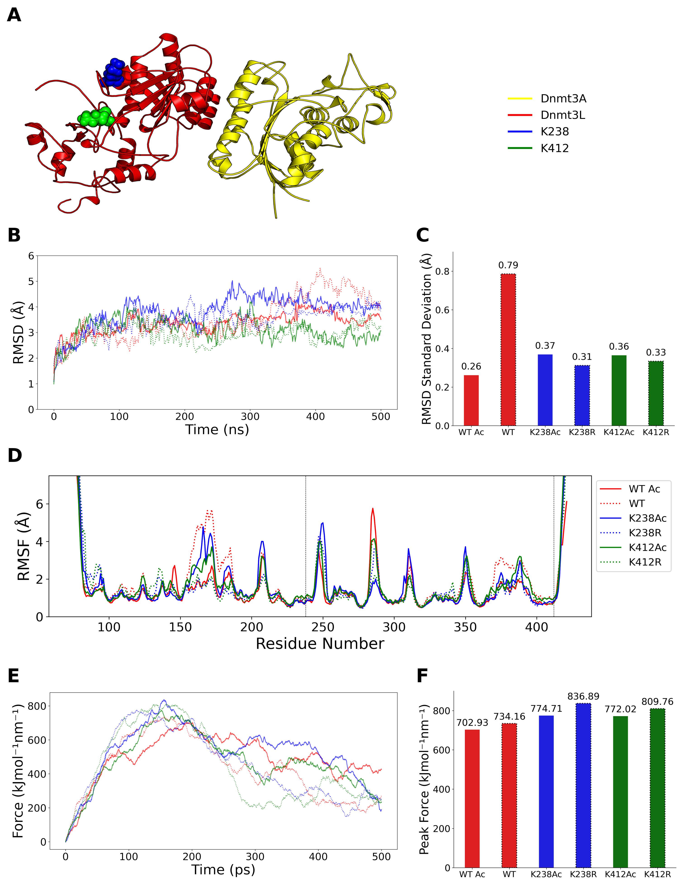

# Computational-Analysis-of-Dnmt3L-Structural-Dynamics-and-Mutational-Effects
Computational investigation of Dnmt3L structural dynamics and mutation-induced effects using molecular modeling and MD simulations.

## Results

### Structural Dynamics and Mechanical Analysis

**Figure 1: Comprehensive structural analysis of Dnmt3A–Dnmt3L complex**

The structural properties of the Dnmt3L mutants were characterized through:

- **Panel a**: Crystal structure highlighting K238 and K412 mutation sites
- **Panel b**: RMSD profiles over 500-ns MD simulations showing structural fluctuations
- **Panel c**: Standard deviation analysis of RMSD values after 100 ns equilibration
- **Panel d**: Per-residue RMSF analysis showing local flexibility differences
- **Panels e & f**: SMD pulling simulations comparing mechanical resistance

## Findings

Stability: ​
> All mutants exhibit some degree of instability, the Wild-type shows significantly larger deviations, indicating greater structural instability.

Flexibility:
>The mutants exhibit reduced flexibility in the binding interface compared to the wild type, suggesting a more rigid conformation in this region. ​

​Binding Affinity: ​
> No significant changes were observed in the binding affinities across all variants, indicating consistent binding strength despite mutations.​
## Citation
If you use any data, methods, or results from this repository, please cite:

> Rahman, N., Nam, Y. J., Kwon, H., Im, H. J., Lubna, H., Lee, S., et al. (2026).
> *Uncovering the acetylation sites of Dnmt3L that regulate protein stability and differentiation potency in embryonic stem cells.*
> **Experimental & Molecular Medicine**, 58, 709–724.
>
> DOI: https://doi.org/10.1038/s12276-026-01655-w

